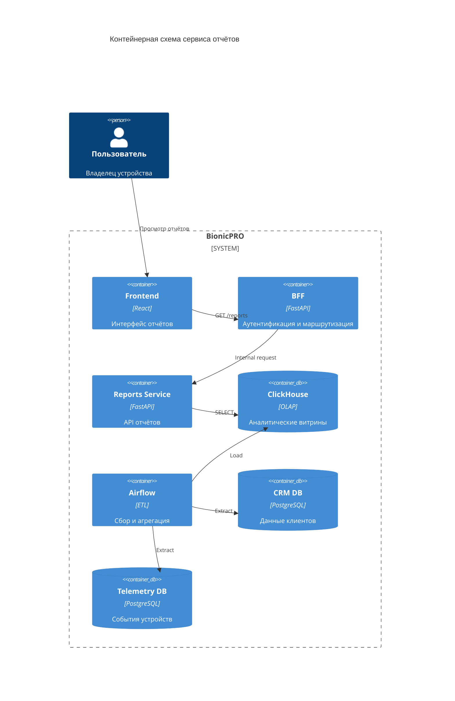

# Архитектура подсистемы отчётности

## Общая идея

Подсистема отчётов отвечает за сбор телеметрии и клиентских данных, их агрегацию и выдачу аналитики пользователям протезов. Архитектура разделена на контуры хранения, обработки и выдачи, чтобы вычислительная нагрузка находилась вне API-слоя.

## Состав решения

### Источники данных

**CRM (PostgreSQL)**
Содержит информацию о пользователях, договорах и моделях устройств.

**Telemetry storage (PostgreSQL)**
Хранит поток сырых событий с устройств: сигналы, заряд батареи, ошибки, координаты и прочие метрики.

### ETL-контур

**Apache Airflow** выполняет роль оркестратора пакетной обработки.

Функции:

* регулярное извлечение данных из CRM и телеметрии;
* расчёт агрегированных показателей;
* формирование витрин для аналитики;
* загрузка результатов в OLAP-хранилище.

### Аналитическое хранилище

**ClickHouse** используется как слой аналитических данных.

Особенности:

* хранение подготовленных таблиц;
* оптимизация под быстрые SELECT-запросы;
* отсутствие тяжёлых вычислений в момент запроса пользователя.

Основная витрина: `user_daily_reports`.

### Сервис отчётов

**Reports Service (FastAPI)** — отдельный backend-сервис.

Назначение:

* чтение витрин из ClickHouse;
* фильтрация по пользователю;
* форматирование ответа;
* отдача данных через API.

Сервис не выполняет тяжёлые вычисления, только доступ к уже подготовленным данным.

### BFF-слой

**Auth/BFF сервис** выступает точкой входа для клиента.

Функции:

* аутентификация;
* получение user_id из сессии;
* проксирование запроса в сервис отчётов;
* контроль доступа к данным.

## Поток обработки

1. Данные пользователей и события устройств сохраняются в PostgreSQL.
2. Airflow по расписанию извлекает информацию.
3. Выполняется агрегация и подготовка витрин.
4. Витрины загружаются в ClickHouse.
5. Пользователь обращается к фронтенду.
6. Запрос проходит через BFF.
7. Reports Service читает витрину и возвращает результат.

## Контейнерная схема

